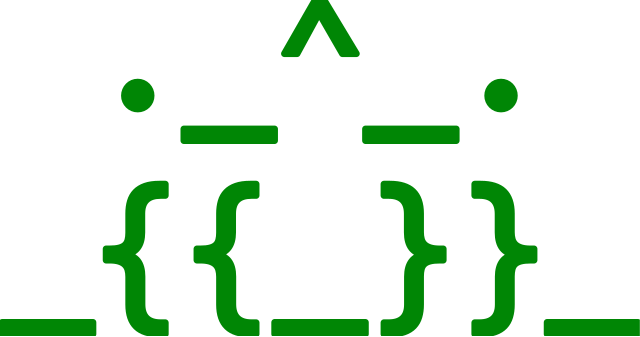

<p align="center">
    <br>
    <a href="https://github.com/AlphaOne1/templig/actions/workflows/test.yml"
       rel="external"
       target="_blank">
        
    </a>
    <a href="https://github.com/AlphaOne1/templig/actions/workflows/codeql.yml"
       rel="external"
       target="_blank">
        
    </a>
    <a href="https://github.com/AlphaOne1/templig/actions/workflows/security.yml"
       rel="external"
       target="_blank">
        
    </a>
    <a href="https://goreportcard.com/report/github.com/AlphaOne1/templig"
       rel="external"
       target="_blank">
        
    </a>
    <a href="https://codecov.io/github/AlphaOne1/templig"
       rel="external"
       target="_blank">
        
    </a>
    <a href="https://www.bestpractices.dev/projects/9251"
       rel="external"
       target="_blank">
        
    </a>
    <a href="https://scorecard.dev/viewer/?uri=github.com/AlphaOne1/templig"
       rel="external"
       target="_blank">
        
    </a>
    <a href="https://app.fossa.com/projects/git%2Bgithub.com%2FAlphaOne1%2Ftemplig?ref=badge_shield&issueType=license"
       rel="external"
       target="_blank">
        
    </a>
    <a href="https://app.fossa.com/projects/git%2Bgithub.com%2FAlphaOne1%2Ftemplig?ref=badge_shield&issueType=security" 
       rel="external"
       target="_blank">
        
    </a>
    <a href="http://godoc.org/github.com/AlphaOne1/templig"
       rel="external"
       target="_blank">
        
    </a>
</p>

```
 ._^_.
_{{_}}_
```

templig
=======

*templig* is configuration library utilizing the text templating engine and the functions best known from helm charts,
that originally stem from [Masterminds/sprig](http://github.com/Masterminds/sprig/v3).
Its primary goal is to enable access to the system environment to fill information using the `env` function. It also
enables to include verifications inside the configuration.

Usage
-----

### Simple Case

Having a configuration file like the following:

```yaml
id:   23
name: Interesting Name
```

The code to read that file would look like this:

```go
package main

import (
	"fmt"
	"github.com/AlphaOne1/templig"
)

type Config struct {
	ID   int    `yaml:"id"`
	Name string `yaml:"name"`
}

func main() {
	c, confErr := templig.FromFile[Config]("my_config.yaml")

	fmt.Printf("read errors: %v", confErr)

	if confErr == nil {
		fmt.Printf("ID:   %v\n", c.Get().ID)
		fmt.Printf("Name: %v\n", c.Get().Name)
	}
}
```

The `Get` method gives a pointer to the internally held Config strucutre that the use supplied. The pinter is always
non-nil, so additional nil-checks are not necessary.

### Advanced Case

Having a templated configuration file like this one:

```yaml
id:   23
name: Interesting Name
pass: {{ env "PASSWORD" | required "password required" | quote }}
```

As demonstrated, one can use the templating functionality that is best known from helm charts. The functions provided
come from the aforementionened [strig](http://github.com/Masterminds/strig/v3)-library.

```go
package main

import (
	"fmt"
	"strings"

	"github.com/AlphaOne1/templig"
)

type Config struct {
	ID   int    `yaml:"id"`
	Name string `yaml:"name"`
	Pass string `yaml:"pass"`
}

func main() {
	c, confErr := templig.FromFile[Config]("my_config.yaml")

	fmt.Printf("read errors: %v", confErr)

	if confErr == nil {
		fmt.Printf("ID:   %v\n", c.Get().ID)
		fmt.Printf("Name: %v\n", c.Get().Name)
		fmt.Printf("Pass: %v\n", strings.Repeat("*", len(c.Get().Pass)))
	}
}
```